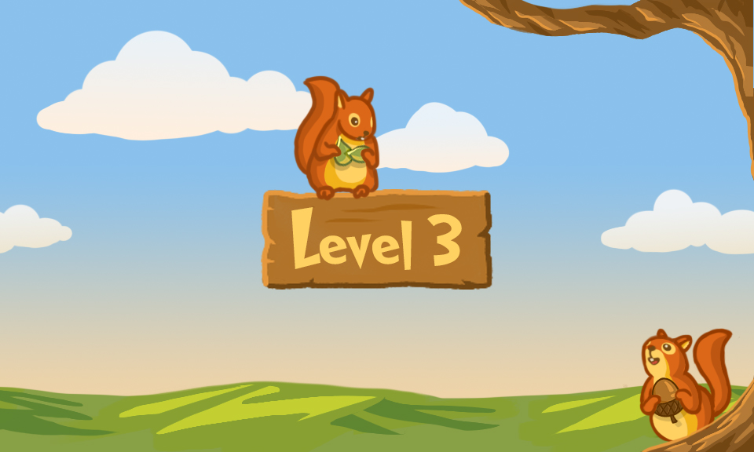
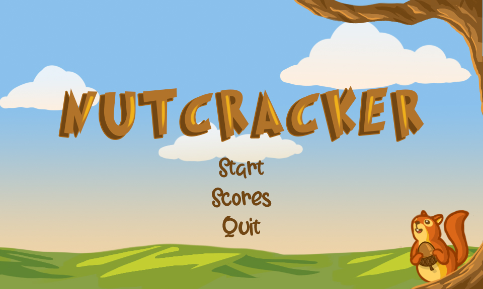

# nutcracker 
A match-3 and block-breakiing inspired puzzle game created with Lua and LOVE, where players complete each level by appropriate matching enough nuts (each is progressively cracked 
open when matched; from husk to shell to fruit, etc.). Levels get increasingly difficult as they introduce new sprites and bonuses. High scores can be saved under multiple users.
I designed all backgrounds, sprites, interfaces, and animations using Adobe Suite.

